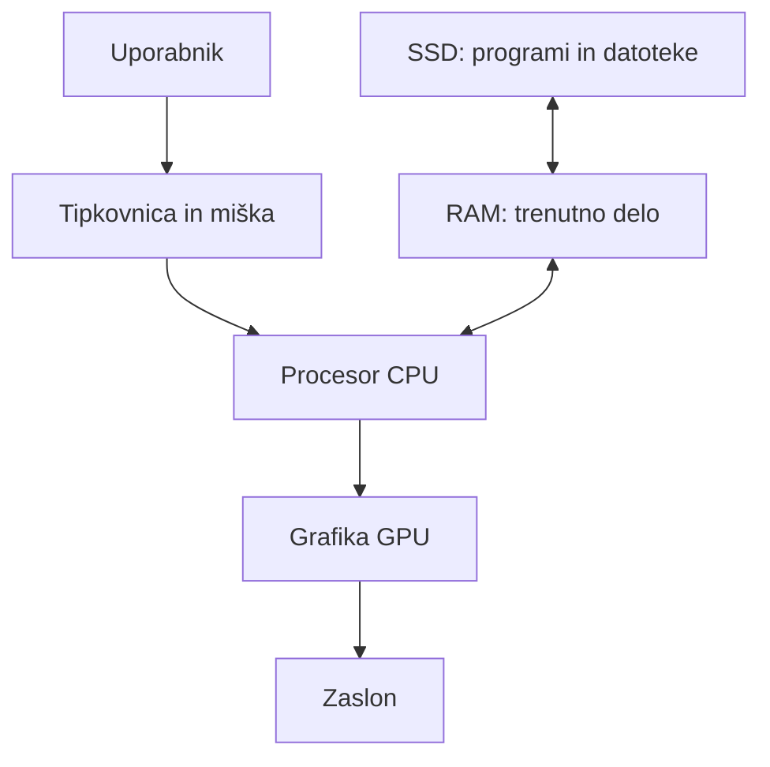
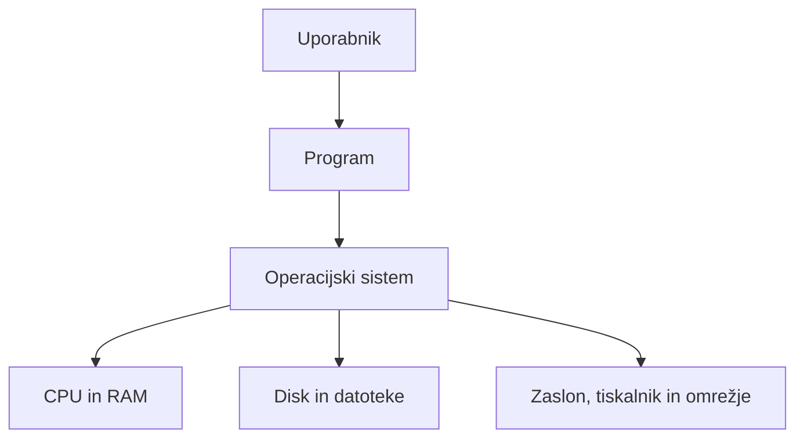

# Sodoben namizni računalnik in programska oprema

## Računalnik

Računalnik je elektronska naprava, ki:

- sprejema podatke,
- jih obdeluje po navodilih,
- shrani podatke in
- prikaže rezultat uporabniku.

**Strojna oprema (hardware)** so fizični deli računalnika.

**Programska oprema (software)** so programi in navodila, ki strojni opremi povedo, kaj naj naredi.

## Glavni deli računalnika

| Del | Namen |
|---|---|
| **Procesor (CPU)** | Izvaja navodila programov in obdeluje podatke. |
| **Delovni pomnilnik (RAM)** | Hrani podatke in programe, s katerimi računalnik trenutno dela. Je hiter, vendar se ob izklopu računalnika izbriše. |
| **SSD oziroma trdi disk (HDD)** | Trajno hrani programe, datoteke in operacijski sistem. Podatki ostanejo shranjeni tudi po izklopu. |
| **Matična plošča** | Povezuje vse notranje dele računalnika. |
| **Grafična kartica (GPU)** | Ustvarja sliko za zaslon. Lahko je samostojna kartica ali del procesorja. |
| **Napajalnik** | Računalniške dele oskrbuje z električno energijo. |
| **Vhodne naprave** | Omogočajo vnos podatkov: tipkovnica, miška, mikrofon, kamera. |
| **Izhodne naprave** | Prikažejo rezultat: zaslon, zvočniki, tiskalnik. |

### RAM in SSD

- **RAM** je podoben delovni mizi: na njej imamo tisto, s čimer trenutno delamo.
- **SSD** je podoben omari z dokumenti: datoteke ostanejo shranjene tudi, ko računalnik ugasnemo.

## Vklop računalnika

Ob vklopu računalnika se zgodi naslednje:

1. Napajalnik vključi komponente.
2. BIOS oziroma UEFI preveri osnovne dele računalnika.
3. Računalnik poišče disk z nameščenim operacijskim sistemom.
4. Operacijski sistem se naloži v RAM.
5. Prikaže se prijavno okno ali namizje.

## Operacijski sistem

**Operacijski sistem (OS)** je osnovna programska oprema računalnika.

Primeri operacijskih sistemov:

- Windows,
- Linux,
- macOS,
- Android in iOS na telefonih.

### Naloge operacijskega sistema

Operacijski sistem:

- upravlja procesor in določa, kateri program se izvaja;
- upravlja delovni pomnilnik;
- upravlja datoteke, mape in diske;
- omogoča uporabo naprav, kot so zaslon, tiskalnik, USB-naprave in omrežje;
- zagotavlja uporabniški vmesnik: namizje, okna, menije;
- skrbi za uporabniške račune, pravice dostopa in varnost.

Za komunikacijo z določeno napravo OS uporablja **gonilnik (driver)**. Gonilnik je program, ki operacijskemu sistemu omogoči delo s konkretno napravo, na primer s tiskalnikom ali grafično kartico.

## Izvajanje programa

Program je zbirka navodil za računalnik.

Ko zaženemo program:

1. Operacijski sistem poišče program na SSD-ju.
2. Program se naloži v RAM.
3. OS ustvari **proces** – okolje, v katerem se program izvaja.
4. CPU izvaja navodila programa.
5. Program prek OS uporablja naprave in prejema podatke od uporabnika.
6. Po zaprtju programa se njegov proces konča, RAM pa se sprosti.

### Primer: urejanje dokumenta

Pri pisanju dokumenta:

- tipkovnica pošlje podatek o pritisnjeni tipki;
- program obdela podatek;
- operacijski sistem poskrbi za prikaz črke na zaslonu;
- dokument je med urejanjem v RAM-u;
- ob ukazu **Shrani** se dokument zapiše na SSD.

## Več programov hkrati

Operacijski sistem omogoča hkratno uporabo več programov.

- Procesor zelo hitro preklaplja med programi.
- Vsak program ima svoj proces in svoj del pomnilnika.
- Če ni dovolj RAM-a, računalnik del podatkov začasno premakne na disk.
- Ker je disk počasnejši od RAM-a, računalnik takrat deluje počasneje.

## Povzetek

- **CPU** izvaja navodila programov.
- **RAM** omogoča hitro trenutno delo.
- **SSD** trajno shranjuje podatke in programe.
- **Operacijski sistem** povezuje uporabnika, programe in strojno opremo.
- Ko zaženemo program, se program naloži v RAM, OS ustvari proces, CPU pa izvaja njegova navodila.

## Preveri razumevanje

1. Kakšna je razlika med RAM-om in SSD-jem?
2. Kateri del računalnika izvaja navodila programa?
3. Zakaj potrebujemo operacijski sistem?
4. Kaj se zgodi z neshranjenim dokumentom, če računalnik nenadoma ostane brez elektrike?
5. Kaj pomeni, da se program izvaja kot proces?
