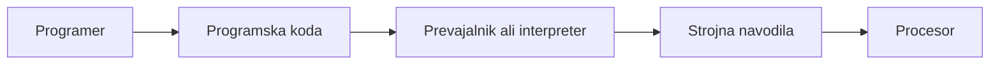
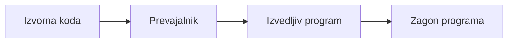
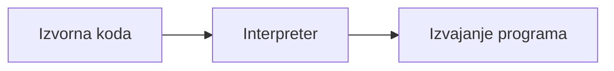

# Programski jeziki

## Kaj je programski jezik?

**Programski jezik** je dogovorjen način zapisovanja navodil za računalnik.

Z njim programer opiše:

- katere podatke program uporablja;
- katero opravilo mora računalnik izvesti;
- v kakšnem vrstnem redu naj izvede korake;
- kako naj prikaže ali shrani rezultat.

Računalnik neposredno ne razume C#, Python, Java ali drugih jezikov. Procesor razume le zelo preprosta navodila, zapisana v strojnem jeziku.



## Kratek zgodovinski razvoj

Prvi računalniki so bili programirani zelo neposredno in zapleteno. Z razvojem programskih jezikov so navodila postajala bolj podobna človekovemu zapisu in lažje razumljiva.

| Obdobje | Značilnost | Primeri |
|---|---|---|
| Zgodnji računalniki | Neposredno programiranje strojne opreme. | Strojni jezik |
| 1950. leta | Uveljavitev zbirnega jezika in prvih višjih jezikov. | Assembly, FORTRAN, COBOL |
| 1960.–1970. leta | Razvoj strukturiranega in proceduralnega programiranja. | BASIC, Pascal, C |
| 1980.–1990. leta | Širitev objektnega programiranja in grafičnih programov. | C++, Java |
| Danes | Veliko jezikov, knjižnic in različnih načinov izvajanja. | C#, JavaScript, Python, Kotlin, Go, Rust |

Nov jezik ne pomeni nujno, da so starejši jeziki neuporabni. Veliko poslovnih in tehničnih sistemov še vedno uporablja COBOL, C, C++ ali Java.

## Strojni jezik

**Strojni jezik** je jezik, ki ga procesor neposredno izvaja.

Sestavljen je iz bitov, torej iz ničel in enic. Navodila so odvisna od vrste procesorja. Program za en tip procesorja zato ni nujno neposredno uporaben za drug tip procesorja.

Primer zelo poenostavljenega zapisa:

```text
10110000 01100001
```

Strojni jezik je zelo hiter za izvajanje, vendar je za človeka težko berljiv, težko ga je pisati in v njem hitro naredimo napako.

## Zbirni jezik (assembly)

**Zbirni jezik** oziroma *assembly* uporablja kratka imena namesto zapisa ničel in enic.

```text
MOV AX, 5
ADD AX, 3
```

Navodilo je še vedno zelo blizu procesorju. Programer mora poznati podrobnosti procesorja, pomnilnika in registrov.

Zbirni jezik je pogosto uvrščen med jezike druge generacije.

## Jeziki tretje generacije

**Jeziki tretje generacije (3GL)** so splošnonamenski višjenivojski programski jeziki. Omogočajo, da programer rešitev zapiše bolj razumljivo in manj odvisno od konkretnega procesorja.

Primer v C#:

```csharp
int vsota = 5 + 3;
Console.WriteLine(vsota);
```

Primer v Pythonu:

```python
vsota = 5 + 3
print(vsota)
```

V primerjavi s strojnim jezikom programer razmišlja o spremenljivkah, pogojih, zankah in funkcijah, ne o posameznih registrih procesorja.

Med jezike tretje generacije sodijo na primer C, C++, C#, Java, Python, JavaScript, Pascal in mnogi drugi.

## Prevajan in interpretiran program

Kodo, ki jo napiše programer, mora računalnik pred izvajanjem ali med izvajanjem pretvoriti v obliko, ki jo lahko izvede.

### Prevajani jeziki

Pri **prevajanju** prevajalnik (*compiler*) pred izvajanjem prebere programsko kodo in ustvari izvedljivo obliko programa.



Značilnosti:

- napake v zapisu pogosto odkrijemo že ob prevajanju;
- uporabnik lahko zažene že pripravljen program;
- prevajanje je lahko prilagojeno določenemu sistemu ali procesorju.

Primeri jezikov, ki se pogosto prevajajo v strojno kodo: C, C++, Go in Rust.

### Interpretirani jeziki

Pri **interpretiranju** interpreter bere program in ga izvaja med samim zagonom.



Značilnosti:

- za zagon je praviloma potreben interpreter oziroma ustrezno okolje;
- program je pogosto enostavno zagnati na različnih sistemih, če je interpreter na voljo;
- nekatere napake se pokažejo šele, ko program pride do določenega dela kode.

Python je pogost primer interpretiranega jezika. JavaScript se običajno izvaja v brskalniku oziroma drugem JavaScript okolju.

### V praksi so meje manj ostre

Delitev na prevajane in interpretirane jezike je poenostavitev.

- Java in C# se najprej prevedeta v vmesno obliko kode.
- Med izvajanjem jo okolje .NET ali Java pogosto dodatno prevede v strojno kodo. Temu pravimo **JIT prevajanje** (*Just-In-Time*).
- JavaScript okolja prav tako pogosto uporabljajo napredne prevajalnike med izvajanjem.

Pomembnejše od oznake je razumevanje, da procesor na koncu izvaja strojna navodila.

## Slogi programiranja

Programski jeziki omogočajo različne načine razmišljanja in organizacije programa. Tem načinom pravimo **programske paradigme** oziroma slogi programiranja.

Veliko sodobnih jezikov podpira več slogov hkrati.

### Proceduralno programiranje

Pri **proceduralnem programiranju** program opišemo kot zaporedje korakov oziroma postopkov.

```text
1. Preberi število.
2. Prištej 10.
3. Izpiši rezultat.
```

Pogosto uporabljamo spremenljivke, pogoje, zanke in funkcije. Primeri jezikov: C, Pascal, BASIC; tudi C# in Python omogočata tak slog.

### Objektno programiranje

Pri **objektnem programiranju** modeliramo stvari kot objekte. Objekt ima podatke in dejavnosti, ki jih zna izvesti.

Primer: objekt `Avto` ima podatke, kot sta barva in hitrost, ter dejavnosti, kot sta `Pospesi()` in `Ustavi()`.

Pogosti jeziki za objektno programiranje: C#, Java, C++, Kotlin, Python in JavaScript.

### Funkcijsko programiranje

Pri **funkcijskem programiranju** je program sestavljen predvsem iz funkcij, ki iz vhodnih podatkov vrnejo rezultat.

Poudarek je na tem, da funkcija po možnosti ne spreminja podatkov zunaj sebe in da za enak vhod vrne enak rezultat.

Funkcijsko programiranje pogosto uvrščamo med deklarativne pristope, saj se osredotoča na pretvorbo podatkov z izrazom oziroma funkcijo, ne na zaporedje ukazov.

Primeri funkcijskih jezikov: Haskell, F#, Clojure in Elixir. Elementi funkcijskega programiranja so na voljo tudi v C#, JavaScriptu, Pythonu in mnogih drugih jezikih.

### Deklarativno programiranje

Pri **deklarativnem programiranju** bolj opišemo, *kaj* želimo dobiti, ne pa vseh korakov, *kako* naj računalnik to naredi.

Primer je SQL:

```sql
SELECT ime FROM Stranke WHERE mesto = 'Celje';
```

Poizvedba pove, katere podatke želimo. Podatkovna zbirka sama izbere podrobne korake za pridobitev rezultata.

## Primerjava slogov

| Slog | Osnovna zamisel | Značilni primer |
|---|---|---|
| Proceduralni | Zaporedje postopkov in ukazov. | Zanka, pogoj, funkcija |
| Objektni | Modeliranje podatkov in dejavnosti v objektih. | Avto, uporabnik, naročilo |
| Funkcijski | Sestavljanje funkcij in rezultatov. | Pretvorba seznama podatkov |
| Deklarativni | Opišemo želeni rezultat. | SQL poizvedba |

## Izbira programskega jezika

Jezik izberemo glede na problem, okolje in potrebe projekta.

| Potreba | Pogosti primeri |
|---|---|
| Spletne strani v brskalniku | JavaScript ali TypeScript |
| Poslovne aplikacije in storitve | C#, Java, Kotlin |
| Analiza podatkov in avtomatizacija | Python, R |
| Sistemska in zmogljiva programska oprema | C, C++, Rust |
| Mobilne aplikacije | Kotlin, Swift, C# |
| Podatkovne poizvedbe | SQL |

Ni enega najboljšega programskega jezika. Pomembni so tudi ljudje v ekipi, obstoječi sistemi, knjižnice, varnost, hitrost razvoja in podpora okolja.

## Povzetek

- Procesor neposredno izvaja strojni jezik.
- Višjenivojski jeziki so za človeka bolj razumljivi in omogočajo hitrejši razvoj.
- Prevajalnik ali interpreter kodo pripravi za izvajanje.
- Prevajani in interpretirani jeziki imajo v praksi pogosto kombinirane načine izvajanja.
- Programski jeziki lahko podpirajo proceduralni, objektni, funkcijski in deklarativni slog.

## Preveri razumevanje

1. Zakaj človek praviloma ne piše programov neposredno v strojnem jeziku?
2. Kaj je glavna razlika med prevajalnikom in interpreterjem?
3. Kaj pomeni, da je C# jezik tretje generacije?
4. Kaj je osnovna zamisel proceduralnega programiranja?
5. Kako se funkcijsko programiranje razlikuje od deklarativnega programiranja?
