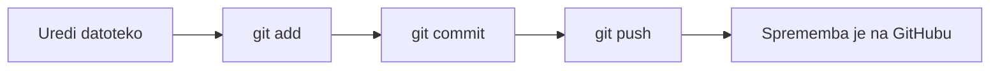

# Osnove dela z GitHubom

V tej vaji bomo na GitHubu ustvarili repozitorij, ga prenesli na računalnik, uredili datoteko `README.md` ter spremembe poslali nazaj na GitHub.

## Pred začetkom

Preverite, ali je Git nameščen. V ukazni vrstici zaženite:

```bash
git --version
```

Če se izpiše številka različice, je Git na voljo.

## 1. Ustvarjanje repozitorija na GitHubu

V spletnem brskalniku odprite GitHub in se prijavite.

1. Kliknite **+** in izberite **New repository**.
2. Izpolnite podatke:

   | Polje | Vrednost |
   |---|---|
   | Repository name | `UvajalniTecaj` |
   | Description | `Primer repozitorija` |
   | Visibility | **Public** |
   | Add a README file | označeno |
   | Add .gitignore | **C++** |
   | Choose a license | **Apache License 2.0** |

3. Kliknite **Create repository**.

Repozitorij je ustvarjen. Vsebuje začetno datoteko `README.md`, datoteko `.gitignore` in licenco.

## 2. Prenos repozitorija na računalnik

Na strani repozitorija kliknite zeleni gumb **Code** in kopirajte naslov HTTPS. Videti je približno tako:

```text
https://github.com/VAŠE-UPORABNIŠKO-IME/UvajalniTecaj.git
```

V ukazni vrstici se premaknite v mapo, kamor želite shraniti projekt. Na primer:

```bash
cd Documents
```

Klonirajte repozitorij. Naslov spodaj zamenjajte s tistim, ki ste ga kopirali z GitHuba:

```bash
git clone https://github.com/VAŠE-UPORABNIŠKO-IME/UvajalniTecaj.git
```

Premaknite se v ustvarjeno mapo in preverite stanje:

```bash
cd UvajalniTecaj
git status
```

Ukaz naj pokaže, da trenutno ni lokalnih sprememb.

## 3. Ureditev datoteke, commit in push

Odprite `README.md` v urejevalniku besedila. V sistemu Windows jo lahko odprete z Beležnico:

```bash
notepad README.md
```

V datoteko dodajte ali spremenite besedilo, na primer:

```text
# Uvajalni tečaj

To je moj prvi repozitorij za vajo z Gitom in GitHubom.
```

Shranite datoteko in zaprite urejevalnik. Nato preverite stanje in si oglejte spremembe:

```bash
git status
git diff
```

Izberite datoteko za naslednji commit:

```bash
git add README.md
```

Ustvarite commit z opisom spremembe:

```bash
git commit -m "Posodobi opis v README"
```

Pošljite commit na GitHub:

```bash
git push
```

Če GitHub zahteva prijavo, sledite prikazanim navodilom. Na spletni strani repozitorija osvežite stran. Videti bi morali posodobljeni `README.md` in svoj commit.

## Kaj pomenijo ukazi?

| Ukaz | Namen |
|---|---|
| `git clone` | Prenese repozitorij z GitHuba na računalnik. |
| `git status` | Pokaže stanje delovne mape in sprememb. |
| `git diff` | Pokaže, kaj se je spremenilo. |
| `git add` | Izbere spremembe, ki bodo vključene v commit. |
| `git commit` | Zabeleži izbrane spremembe v lokalnem repozitoriju. |
| `git push` | Pošlje lokalne commite na GitHub. |



## Vprašanja za preverjanje razumevanja

1. Kaj pomeni, da repozitorij kloniramo?
2. Kateri ukaz pokaže stanje delovne mape?
3. Čemu služi ukaz `git add`?
4. Kaj se zgodi, ko izvedemo `git commit`?
5. Kateri ukaz pošlje lokalne commite na GitHub?
