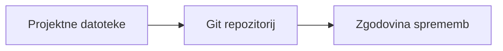
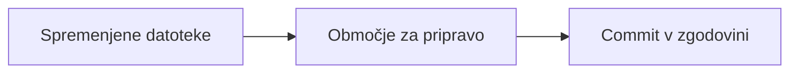
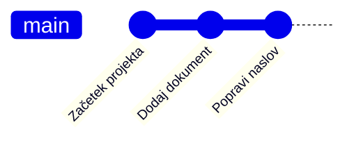
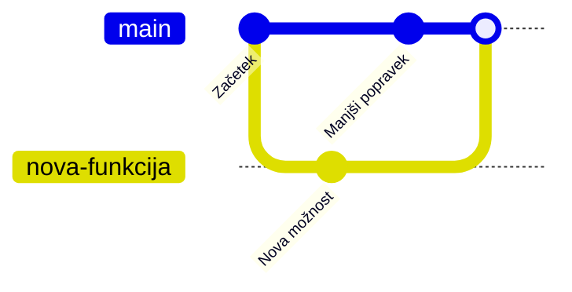

# Git – zgodovina sprememb v projektu

## Kaj je Git?

**Git** je sistem za sledenje spremembam v datotekah projekta.

Omogoča nam, da:

- vidimo, kaj se je v projektu spremenilo;
- se vrnemo na starejšo različico datoteke;
- varno preizkusimo spremembe;
- sodelujemo z drugimi pri istem projektu.

Git ni program za pisanje kode. Je orodje, ki hrani zgodovino projekta.

## Repozitorij

**Repozitorij** (ang. *repository*) je mapa projekta, ki ji Git sledi.

V repozitoriju so običajne datoteke projekta, na primer dokumenti, slike in izvorna koda. Git poleg njih v skriti mapi `.git` hrani podatke o zgodovini sprememb.



## Sprememba in commit

Ko spremenimo datoteko, Git zazna, da se njena trenutna vsebina razlikuje od zadnje shranjene različice v zgodovini.

**Commit** je shranjen posnetek izbranih sprememb v zgodovini projekta.

Commit običajno vsebuje:

- spremembe datotek;
- avtorja spremembe;
- datum in čas;
- kratko sporočilo, ki pove, kaj se je spremenilo.

Primer dobrega sporočila commita:

```text
Dodaj razlago operacijskega sistema
```

Primer slabega sporočila:

```text
Popravek
```

Dobro sporočilo pomaga sodelavcem razumeti zgodovino projekta.

## Območje za pripravo sprememb

Pred commitom Git omogoča izbiro sprememb, ki jih želimo vključiti v naslednji posnetek. To imenujemo **območje za pripravo** (ang. *staging area*).

Zato se delo pogosto izvaja v treh korakih:

1. Spremenimo datoteko v projektu.
2. Izberemo spremembe, ki jih želimo vključiti.
3. Ustvarimo commit s kratkim opisom.



## Zgodovina projekta

Commite si lahko predstavljamo kot zaporedje posnetkov projekta.



Vsak commit ima svojo oznako oziroma identifikator. Git lahko primerja različne različice in pokaže, kaj se je med njimi spremenilo.

## Veje

**Veja** (ang. *branch*) je samostojna smer razvoja znotraj istega repozitorija.

Glavna veja projekta se pogosto imenuje `main`. Novo vejo ustvarimo, kadar želimo pripraviti spremembo, ne da bi takoj posegali v glavno različico projekta.

Primeri uporabe vej:

- nova funkcionalnost;
- popravek napake;
- preizkus nove zamisli.

Ko je delo na veji dokončano in preverjeno, lahko spremembe združimo nazaj v glavno vejo. Temu pravimo **merge** oziroma združevanje.



## Oddaljeni repozitorij

Repozitorij je lahko shranjen le na našem računalniku. Pogosto pa ga povežemo tudi z oddaljenim repozitorijem na strežniku, na primer na GitHubu, GitLabu ali Azure DevOpsu.

Oddaljeni repozitorij omogoča:

- varnostno kopijo projekta;
- skupno delo ekipe;
- dostop do projekta z več računalnikov.

Najpogostejša dejanja so:

| Dejanje | Pomen |
|---|---|
| **clone** | Na svoj računalnik prenesemo obstoječi repozitorij. |
| **push** | Svoje commite pošljemo na oddaljeni repozitorij. |
| **pull** | Prenesemo nove spremembe drugih sodelavcev. |

## Pomembna navada

Git ne zamenja varnostnih kopij, vendar zelo pomaga pri urejenem delu.

- Commite ustvarjamo pogosto in po smiselnih celotah.
- Sporočila commitov naj jasno opišejo spremembo.
- Pred večjo spremembo preverimo trenutno stanje projekta.
- V repozitorij ne shranjujemo gesel, žetonov ali drugih skrivnih podatkov.

## Povzetek

- Git hrani zgodovino sprememb projekta.
- Repozitorij je projektna mapa, ki ji Git sledi.
- Commit je opisan posnetek sprememb.
- Veje omogočajo ločeno delo na spremembah.
- Oddaljeni repozitorij omogoča sodelovanje in skupno shranjevanje projekta.

## Preveri razumevanje

1. Kaj je namen sistema Git?
2. Kaj je repozitorij?
3. Kaj predstavlja commit?
4. Zakaj uporabljamo veje?
5. Kakšna je razlika med `push` in `pull`?
