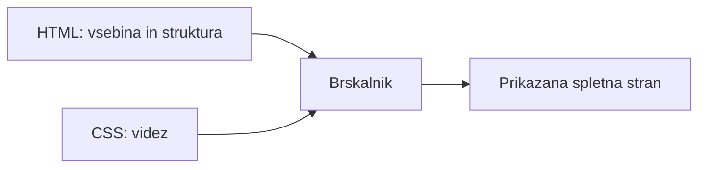
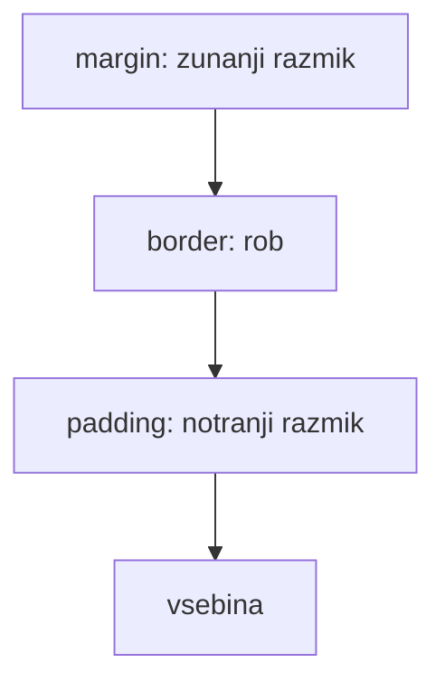

# HTML in CSS – osnove spletne strani

## Spletna stran v brskalniku

Ko odpremo spletno stran, brskalnik prenese njene datoteke in jih prikaže na zaslonu.

- **HTML** pove, katera vsebina je na strani in kako je strukturirana.
- **CSS** določa videz te vsebine.
- **JavaScript** lahko doda vedenje in odzivnost; v tem gradivu ga ne obravnavamo.



Primerjava:

- HTML je kot skelet in vsebina hiše: stene, sobe, vrata in napis na vratih.
- CSS je kot barva sten, velikost oken, pohištvo in razporeditev prostorov.

## HTML

**HTML** pomeni *HyperText Markup Language*. Je jezik za opis strukture spletne strani.

Datoteka HTML ima običajno končnico `.html`, na primer `index.html`.

### Elementi in oznake

HTML uporablja **elemente**. Večino elementov napišemo z začetno in končno oznako:

```html
<p>To je odstavek.</p>
```

- `<p>` je začetna oznaka.
- `</p>` je končna oznaka.
- Besedilo med oznakama je vsebina elementa.

Nekateri elementi nimajo končne oznake, na primer slika:

```html

```

### Osnovna zgradba HTML dokumenta

```html
<!doctype html>
<html lang="sl">
  <head>
    <meta charset="utf-8">
    <title>Moja prva spletna stran</title>
  </head>
  <body>
    <h1>Pozdravljeni!</h1>
    <p>To je moja spletna stran.</p>
  </body>
</html>
```

| Del | Namen |
|---|---|
| `<!doctype html>` | Brskalniku pove, da gre za sodoben HTML dokument. |
| `<html>` | Vsebuje celoten dokument. |
| `<head>` | Vsebuje podatke o strani, ki praviloma niso neposredno prikazani. |
| `<title>` | Besedilo, prikazano na zavihku brskalnika. |
| `<body>` | Vsebuje vidno vsebino spletne strani. |

### Pogosti HTML elementi

| Element | Namen |
|---|---|
| `<h1>` do `<h6>` | Naslovi različnih ravni. |
| `<p>` | Odstavek besedila. |
| `<strong>` | Pomembno oziroma krepko besedilo. |
| `<a>` | Povezava. |
| `` | Slika. |
| `<ul>` in `<li>` | Neoštevilčen seznam. |
| `<ol>` in `<li>` | Oštevilčen seznam. |
| `<div>` | Splošen vsebnik za skupino elementov. |

Primer povezave, slike in seznama:

```html
<p>Obiščite <a href="https://www.wikipedia.org/">Wikipedijo</a>.</p>


<ul>
  <li>Tipkovnica</li>
  <li>Miška</li>
  <li>Zaslon</li>
</ul>
```

### Atributi

**Atribut** elementu poda dodatno informacijo. Zapišemo ga v začetno oznako.

```html
<a href="https://example.com">Povezava</a>
```

V tem primeru je `href` atribut, ki določa naslov povezave.

Pogosti atributi:

| Atribut | Uporaba |
|---|---|
| `href` | Cilj povezave. |
| `src` | Naslov slike, skripte ali druge datoteke. |
| `alt` | Besedilni opis slike. |
| `class` | Ime skupine elementov za oblikovanje s CSS. |
| `id` | Enolično ime posameznega elementa. |

`alt` ni le dodaten opis: pomaga uporabnikom, ki uporabljajo bralnike zaslona, in se prikaže, če slike ni mogoče naložiti.

## CSS

**CSS** pomeni *Cascading Style Sheets*. Določa videz HTML elementov.

Datoteka CSS ima običajno končnico `.css`, na primer `style.css`.

CSS datoteko povežemo s HTML dokumentom znotraj elementa `<head>`:

```html
<link rel="stylesheet" href="style.css">
```

### Pravilo CSS

CSS pravilo je sestavljeno iz izbirnika, lastnosti in vrednosti.

```css
p {
  color: navy;
  font-size: 18px;
}
```

| Del | Pomen |
|---|---|
| `p` | Izbirnik: izbere vse odstavke. |
| `color` | Lastnost, ki jo spreminjamo. |
| `navy` | Vrednost lastnosti. |
| `font-size: 18px;` | Nastavi velikost črk na 18 slikovnih pik. |

### Izbirniki

Izbirnik pove, katere HTML elemente želimo oblikovati.

```css
h1 {
  color: darkgreen;
}

.pomembno {
  background-color: lightyellow;
}

#glavni-naslov {
  text-align: center;
}
```

| Izbirnik | Izbere |
|---|---|
| `h1` | vse elemente `<h1>` |
| `.pomembno` | vse elemente z `class="pomembno"` |
| `#glavni-naslov` | element z `id="glavni-naslov"` |

Primer uporabe razreda:

```html
<p class="pomembno">To sporočilo naj izstopa.</p>
```

Razred lahko uporabimo pri več elementih. `id` naj bo na isti strani uporabljen le enkrat.

### Barve, pisava in razmik

```css
body {
  font-family: Arial, sans-serif;
  background-color: #f4f4f4;
  color: #222222;
}

h1 {
  color: #0066cc;
}

.kartica {
  background-color: white;
  padding: 20px;
  margin: 16px;
  border: 1px solid #cccccc;
}
```

- `color` določa barvo besedila.
- `background-color` določa barvo ozadja.
- `font-family` določa pisavo.
- `padding` je notranji razmik med vsebino in robom elementa.
- `margin` je zunanji razmik med elementom in okolico.
- `border` določa rob okoli elementa.



## Skupni primer HTML in CSS

Datoteka `index.html`:

```html
<!doctype html>
<html lang="sl">
  <head>
    <meta charset="utf-8">
    <title>Računalniški krožek</title>
    <link rel="stylesheet" href="style.css">
  </head>
  <body>
    <div class="kartica">
      <h1>Računalniški krožek</h1>
      <p>Dobrodošli na naši spletni strani.</p>
      <a href="https://example.com">Preberite več</a>
    </div>
  </body>
</html>
```

Datoteka `style.css`:

```css
body {
  font-family: Arial, sans-serif;
  background-color: #eef5ff;
}

.kartica {
  background-color: white;
  margin: 30px;
  padding: 20px;
  border: 1px solid #99bbee;
}

h1 {
  color: #0055aa;
}
```

HTML ustvari naslov, odstavek in povezavo. CSS določi pisavo, barve, razmike in robove.

## Pomembna pravila

- HTML opisuje pomen in strukturo, CSS pa videz.
- Oznake morajo biti pravilno zaprte in ugnezdene.
- Uporabljajmo smiselne elemente: naslov naj bo `<h1>`, odstavek pa `<p>`.
- Za večkrat uporabljeno oblikovanje uporabimo `class`.
- Slike naj imajo smiseln atribut `alt`.
- HTML in CSS datoteke lahko odpiramo v katerem koli urejevalniku besedila, rezultat pa vidimo v brskalniku.

## Preveri razumevanje

1. Kakšna je glavna razlika med HTML in CSS?
2. Kateri del HTML dokumenta vsebuje vidno vsebino strani?
3. Kaj je atribut HTML in čemu služi `href`?
4. Kaj izbere CSS izbirnik `.pomembno`?
5. Kakšna je razlika med `padding` in `margin`?
